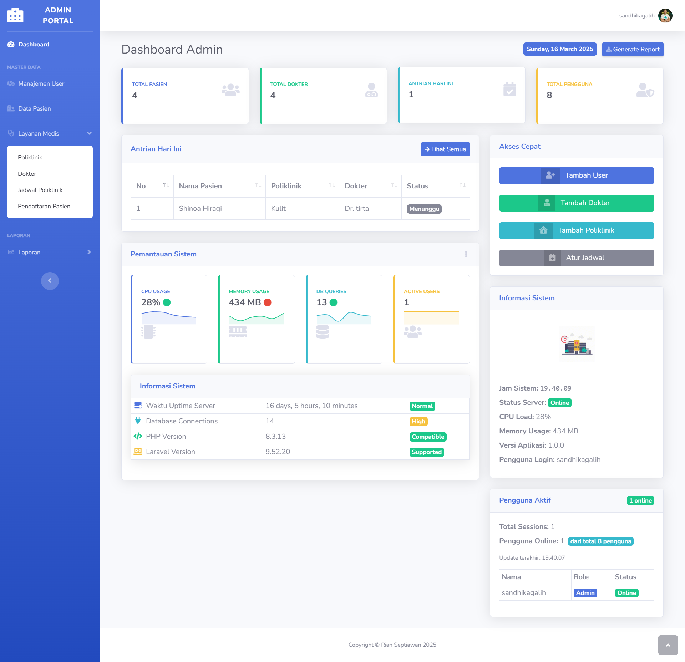
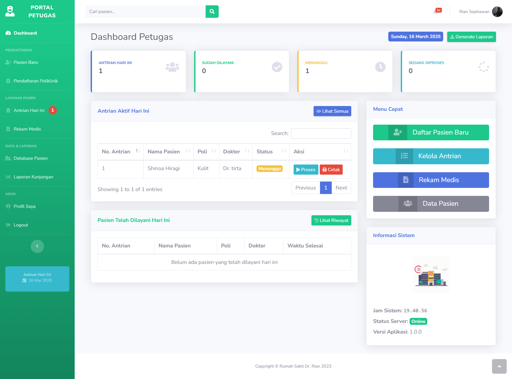
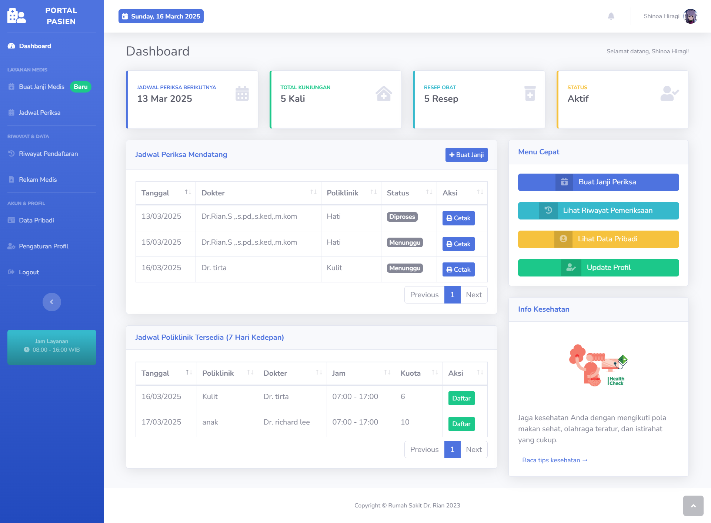

<div align="right">

<a href="README.md"></a> |
<a href="README-ID.md"></a>

</div>

# 🏥 Rekam Medis Akademik Polanka

<div align="center">


</div>

A comprehensive web application for managing hospital operations, appointments, and patient records built with Laravel for Politeknik Negeri Ketapang (Polanka).


## ✨ Features

### Multi-Role System

-   **👩‍💼 Admin**: System management, user control, and analytics
-   **👨‍⚕️ Staff**: Patient registration, appointment handling, and medical records
-   **🧑‍🤝‍🧑 Patient**: Book appointments, track queue, and access medical history

### Admin Portal



-   Comprehensive dashboard with real-time metrics
-   User management (create, update, delete)
-   Department/Poliklinik management
-   Doctor scheduling
-   System performance monitoring
-   Reporting and analytics

### Staff Portal



-   Patient registration and management
-   Appointment processing
-   Queue management
-   Medical record access
-   Daily patient reports

### Patient Portal



-   Appointment booking
-   Queue tracking
-   Medical history access
-   Prescription history
-   Profile management
-   Service rating system

## 🛠️ Technology Stack

<div align="center">

<a href=""></a> <a href=""></a> <a href=""></a>

</div>

## 📋 Requirements

-   PHP >= 8.4
-   MySQL
-   Composer
-   Node.js & NPM

## 🚀 Installation

1. **Clone the repository**

```bash
git clone https://github.com/yourusername/hospital-management-system.git
cd hospital-management-system
```

2. **Install PHP dependencies**

```bash
composer install
```

3. **Install JavaScript dependencies**

```bash
npm install && npm run dev
```

4. **Configure environment**

```bash
cp .env.example .env
```

5. **Update database settings in .env**

```
DB_CONNECTION=mysql
DB_HOST=127.0.0.1
DB_PORT=3306
DB_DATABASE=rumah_sakit_laravel
DB_USERNAME=root
DB_PASSWORD=
```

6. **Generate application key**

```bash
php artisan key:generate
```

7. **Run migrations and seeders**

```bash
php artisan migrate --seed
```

8. **Start development server**

```bash
php artisan serve
```

## 👥 Default Login Credentials

| Role    | Email               | Password |
| ------- | ------------------- | -------- |
| Admin   | admin@polanka.com   | password |
| Staff   | petugas@polanka.com | password |
| Patient | pasien@polanka.com  | password |

## 📊 System Architecture

```
app/
├── Http/
│   ├── Controllers/      # Route controllers
│   ├── Middleware/       # Request middleware
│   └── Requests/         # Form requests
├── Models/               # Database models
├── Providers/            # Service providers
├── Services/             # Business logic
└── Resources/
    ├── views/            # Blade templates
    ├── js/               # JavaScript
    └── css/              # Stylesheets
```

## 🔄 Workflow

1. Patients register and book appointments
2. Staff process appointments and manage queue
3. Doctors see patients and update medical records
4. Admin oversees the entire system and generates reports

## 📚 Documentation

Detailed documentation is available in the `docs/` directory:

-   [Documentation](docs/installation.md)

## 🤝 Contributing

Contributions are welcome! Please feel free to submit a Pull Request.

## 📝 License

This project is licensed under the MIT License - see the [LICENSE](LICENSE) file for details.

## 👏 Acknowledgements

-   Laravel Community
-   Bootstrap Team
-   All contributors who have helped improve this system
